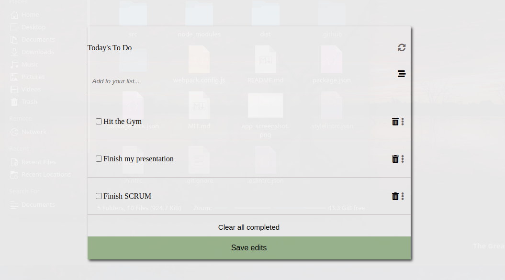

# To-D0 List

> "To-do list" is a tool that helps to organize your day. It simply lists the things that you need to do and allows you to mark them as complete.

## Built With

- Webpack
- JavaScript (ES6)
- CSS
- HTML

## Live Demo
[Click here to view](https://cwaku.github.io/to-do-list/)

## Getting Started

To get a local copy up and running follow these simple steps.

### Prerequisites

some knowledge on `npm` webpack and ES6

### Setup

- Clone repository
- run `npm start`
### Install

- Node modules
- HtmlWebpackPlugin `npm install --save-dev html-webpack-plugin`
- Load CSS `npm install --save-dev style-loader css-loader`
- Setup local dev server `npm install --save-dev webpack-dev-server`

## Author 👤 

- GitHub: [@cwaku](https://github.com/cwaku)
- LinkedIn: [Ricky Mormor](www.linkedin.com/in/ricky-mormor)
- Instagram: [@rickymormor](https://instagram.com/rickymormor)

## 🤝 Contributing

Contributions, issues, and feature requests are welcome!

Feel free to check the [issues page](https://github.com/cwaku/to-do-list/issues).

## Show your support

Give a ⭐️ if you like this project!
## 📝 License

This project is [MIT](./MIT.md) licensed.
